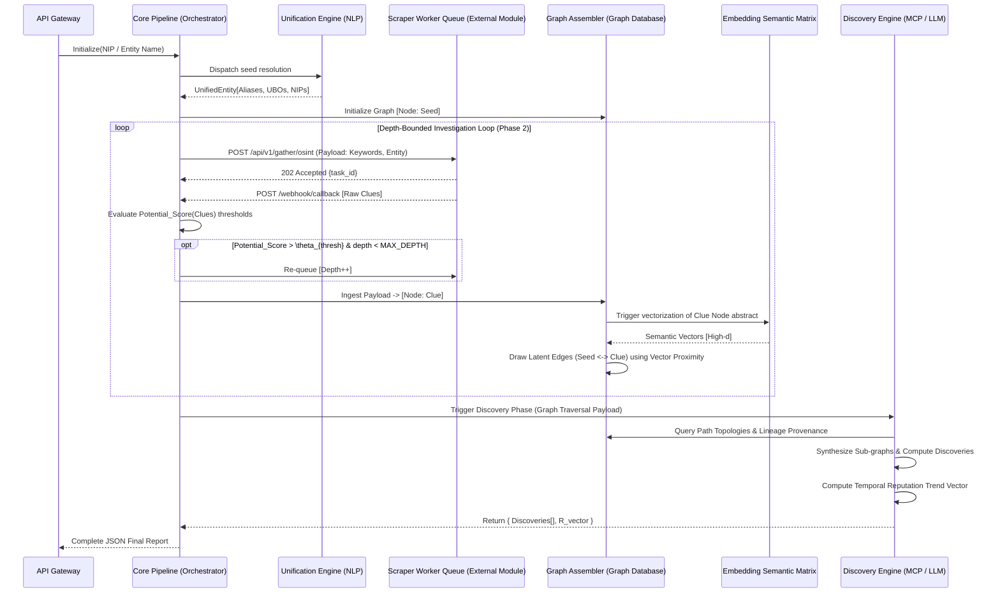

# EXECUTIVE ARCHITECTURE SUMMARY

## 1.1 CORE PURPOSE & SYSTEM DOCTRINE
This AML/Due Diligence investigation system operates as a **Decoupled Intelligence & Acquisition Pipeline**. It maps entity lineage, synthesizes multi-lingual OSINT (focusing on Polish context and strict regulatory frameworks), identifies anomalous correlations, and computes algorithmic severity scores. 

## 1.2 ARCHITECTURE PARADIGM
- **Asynchronicity Base:** The core AI Pipeline (Graph Assembler + Discovery Engine) is strictly decoupled from the web-scraping/OSINT data acquisition modules via HTTP webhooks and queuing systems.
- **Topological Data Backbone:** All data (seeds, text clues, discoveries) is mapped onto a **Directed Property Graph** enabling multihop semantic reasoning.
- **Bipartite Metric Yield:**
  - `Severity_Score` ($S_t \in [0, 1]$) – Instantaneous localized risk per edge.
  - `Reputation Vector` ($\mathbf{R} = [R_{t-n}, \dots, R_t]$) – Temporally decayed Bayesian time-series index.

## 1.3 SYSTEM TOPOLOGY & AGENT WORKFLOW

