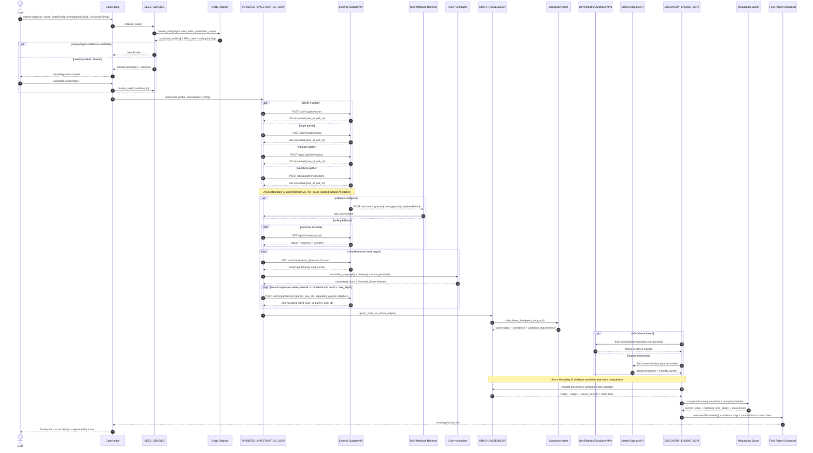

# EXECUTIVE ARCHITECTURE SUMMARY & TOPOLOGY

Codex split of the full architecture bible sectioning executive doctrine, topology, and async workflow.

# 1. EXECUTIVE ARCHITECTURE SUMMARY

| Phase | Purpose | Primary Input | Primary Output | Hard Constraint |
| --- | --- | --- | --- | --- |
| `SEED_GENESIS` | Resolve the investigated company into a canonical seed entity | `NIP` or fuzzy company name | `SeedProfile` + ranked candidate set + ambiguity state | deterministic ID match first, fuzzy only after normalization/alias expansion |
| `TARGETED_INVESTIGATION_LOOP` | Collect scope-bound OSINT/legal/sanctions/registry clues and recursively expand only high-value branches | `SeedProfile`, `InvestigationConfig` | normalized `Clue[]` | AI pipeline never touches raw HTML/PDF; only external Scraper Module does |
| `GRAPH_ASSEMBLER` | Convert clues into a provenance-preserving directed property graph | `Clue[]` | typed `Node[]`, `Edge[]`, `source_parents[]` | every node/edge/discovery must trace to source spans |
| `DISCOVERY_ENGINE` | Synthesize evidence into explainable AML/DD discoveries and company reputation score timeline | seed subgraph + official enrichments + market signals + `DiscoveryConfig` | `Discoveries[]`, `current_score`, `historical_time_series[]`, report bundle | no source-free inference; unresolved links remain `latent` |

**Optimization target**

- Maximize challenge score by centering `article-risk inference`, `industry-aware sentiment`, `entity unification`, `historical scoring`, `demo-grade explainability`.
- Treat crawling as replaceable infrastructure; treat `scoring logic + evidence traceability` as the product core.
- Use `risk sentiment`, not generic polarity. Positive/neutral/negative news classification is insufficient for AML/DD.

**Canonical runtime objects**

- `Case`: investigation container.
- `SeedProfile`: canonical investigated entity + aliases + board + UBO + subsidiaries + industry.
- `Clue`: normalized output from the external Scraper Module.
- `Graph`: directed property graph with provenance on all assertions.
- `Discovery`: evidence-backed probable/confirmed infraction or risk event.
- `TimelinePoint`: bucketed reputation score and delta.

**Entity-resolution decision rule**

\[
ER(q,e)=w_{nip}N+w_{exact}X+w_{alias}A+w_{acro}C+w_{board}B+w_{ubo}U+w_{industry}I+w_{jurisdiction}J-w_{homonym}H
\]

Default weights for seed resolution:

\[
(w_{nip},w_{exact},w_{alias},w_{acro},w_{board},w_{ubo},w_{industry},w_{jurisdiction},w_{homonym})=(0.45,0.20,0.10,0.05,0.06,0.04,0.04,0.06,0.20)
\]

Acceptance rule:

\[
accept(e^\*) \iff ER(q,e^\*) \ge T_{accept} \land \left(ER(q,e^\*)-ER(q,e_2)\right)\ge T_{margin}
\]

where `e2` is runner-up candidate. If false, case enters `AMBIGUOUS` state.

**Investigation control rule**

- Start with `seed aliases + board members + UBOs + subsidiaries + search vectors`.
- Every returned clue receives `Potential_Score(c) ∈ [0,1]`.
- Re-queue only if `Potential_Score(c) ≥ InvestigationConfig.threshold` and `depth < max_search_depth`.
- Terminate branch on low potential, duplicate dominance, or depth exhaustion.

**Evidence truth policy**

- `Direct evidence` > `role-linked evidence` > `latent association`.
- `Official/legal/sanctions evidence` dominates conflicting media evidence.
- Mentions without actor-role alignment do not directly score the company.
- Allegation, investigation, charge, sanction, conviction, denial, acquittal, settlement are distinct claim states with different weights and decay.

**Hackathon-fit build ordering**

1. `Entity resolution + SeedProfile`
2. `Context-aware article risk scoring`
3. `Explainable reputation score + history`
4. `Graph provenance + discovery synthesis`
5. `Bonus enrichments`: sanctions, stock correlation, continuous crawling

# 2. SYSTEM TOPOLOGY & AGENT WORKFLOW

