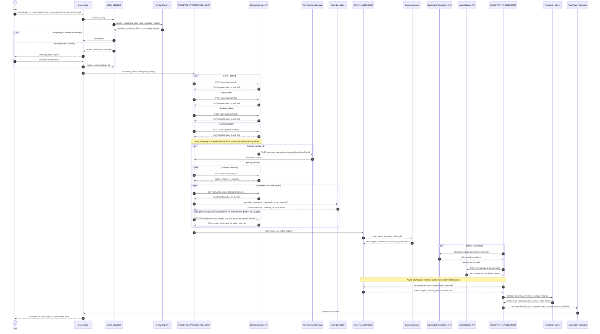

# 1. EXECUTIVE ARCHITECTURE SUMMARY

| Phase | Purpose | Primary Input | Primary Output | Hard Constraint |
| --- | --- | --- | --- | --- |
| `SEED_GENESIS` | Resolve the investigated company into a canonical seed entity | `NIP` or fuzzy company name | `SeedProfile` + ranked candidate set + ambiguity state | deterministic ID match first, fuzzy only after normalization/alias expansion |
| `TARGETED_INVESTIGATION_LOOP` | Collect scope-bound OSINT/legal/sanctions/registry clues and recursively expand only high-value branches | `SeedProfile`, `InvestigationConfig` | normalized `Clue[]` | AI pipeline never touches raw HTML/PDF; only external Scraper Module does |
| `GRAPH_ASSEMBLER` | Convert clues into a provenance-preserving directed property graph | `Clue[]` | typed `Node[]`, `Edge[]`, `source_parents[]` | every node/edge/discovery must trace to source spans |
| `DISCOVERY_ENGINE` | Synthesize evidence into explainable AML/DD discoveries and company reputation score timeline | seed subgraph + official enrichments + market signals + `DiscoveryConfig` | `Discoveries[]`, `current_score`, `historical_time_series[]`, report bundle | no source-free inference; unresolved links remain `latent` |

**Optimization target**

- Maximize challenge score by centering `article-risk inference`, `industry-aware sentiment`, `entity unification`, `historical scoring`, `demo-grade explainability`.
- Treat crawling as replaceable infrastructure; treat `scoring logic + evidence traceability` as the product core.
- Use `risk sentiment`, not generic polarity. Positive/neutral/negative news classification is insufficient for AML/DD.

**Canonical runtime objects**

- `Case`: investigation container.
- `SeedProfile`: canonical investigated entity + aliases + board + UBO + subsidiaries + industry.
- `Clue`: normalized output from the external Scraper Module.
- `Graph`: directed property graph with provenance on all assertions.
- `Discovery`: evidence-backed probable/confirmed infraction or risk event.
- `TimelinePoint`: bucketed reputation score and delta.

**Entity-resolution decision rule**

```math
ER(q,e)=w_{nip}N+w_{exact}X+w_{alias}A+w_{acro}C+w_{board}B+w_{ubo}U+w_{industry}I+w_{jurisdiction}J-w_{homonym}H
```

Default weights for seed resolution:

```math
(w_{nip},w_{exact},w_{alias},w_{acro},w_{board},w_{ubo},w_{industry},w_{jurisdiction},w_{homonym})=(0.45,0.20,0.10,0.05,0.06,0.04,0.04,0.06,0.20)
```

Acceptance rule:

```math
accept(e^\*) \iff ER(q,e^\*) \ge T_{accept} \land \left(ER(q,e^\*)-ER(q,e_2)\right)\ge T_{margin}
```

where `e2` is runner-up candidate. If false, case enters `AMBIGUOUS` state.

**Investigation control rule**

- Start with `seed aliases + board members + UBOs + subsidiaries + search vectors`.
- Every returned clue receives `Potential_Score(c) ∈ [0,1]`.
- Re-queue only if `Potential_Score(c) ≥ InvestigationConfig.threshold` and `depth < max_search_depth`.
- Terminate branch on low potential, duplicate dominance, or depth exhaustion.

**Evidence truth policy**

- `Direct evidence` > `role-linked evidence` > `latent association`.
- `Official/legal/sanctions evidence` dominates conflicting media evidence.
- Mentions without actor-role alignment do not directly score the company.
- Allegation, investigation, charge, sanction, conviction, denial, acquittal, settlement are distinct claim states with different weights and decay.

**Hackathon-fit build ordering**

1. `Entity resolution + SeedProfile`
2. `Context-aware article risk scoring`
3. `Explainable reputation score + history`
4. `Graph provenance + discovery synthesis`
5. `Bonus enrichments`: sanctions, stock correlation, continuous crawling

# 2. SYSTEM TOPOLOGY & AGENT WORKFLOW



# 3. DATA CONTRACTS & SCHEMAS

## External Scraper HTTP API Specs (OpenAPI-style)

```yaml
openapi: 3.1.0
info:
  title: External Scraper Contract
  version: "1.0"
servers:
  - url: /api/v1

paths:
  /gather/osint:
    post:
      summary: Gather public media, trade press, and open web evidence for the seed entity and search vectors.
      headers:
        X-Idempotency-Key: { schema: { type: string } }
      requestBody:
        required: true
        content:
          application/json:
            schema:
              $ref: '#/components/schemas/OsintGatherRequest'
      responses:
        "202":
          description: Async task accepted
          content:
            application/json:
              schema:
                $ref: '#/components/schemas/AsyncTaskAccepted'

  /gather/legal:
    post:
      summary: Gather legal, court, registry-adjacent, and official public document evidence.
      headers:
        X-Idempotency-Key: { schema: { type: string } }
      requestBody:
        required: true
        content:
          application/json:
            schema:
              $ref: '#/components/schemas/LegalGatherRequest'
      responses:
        "202":
          description: Async task accepted
          content:
            application/json:
              schema:
                $ref: '#/components/schemas/AsyncTaskAccepted'

  /gather/registry:
    post:
      summary: Gather public registry data for company aliases, officers, UBOs, subsidiaries, addresses, sector codes.
      headers:
        X-Idempotency-Key: { schema: { type: string } }
      requestBody:
        required: true
        content:
          application/json:
            schema:
              $ref: '#/components/schemas/RegistryGatherRequest'
      responses:
        "202":
          description: Async task accepted
          content:
            application/json:
              schema:
                $ref: '#/components/schemas/AsyncTaskAccepted'

  /gather/sanctions:
    post:
      summary: Resolve direct and adjacency-based sanctions hits against entity, board, UBO, subsidiaries.
      headers:
        X-Idempotency-Key: { schema: { type: string } }
      requestBody:
        required: true
        content:
          application/json:
            schema:
              $ref: '#/components/schemas/SanctionsGatherRequest'
      responses:
        "202":
          description: Async task accepted
          content:
            application/json:
              schema:
                $ref: '#/components/schemas/AsyncTaskAccepted'

  /task/{task_id}:
    get:
      summary: Poll async task state.
      parameters:
        - in: path
          name: task_id
          required: true
          schema: { type: string }
      responses:
        "200":
          description: Task status
          content:
            application/json:
              schema:
                $ref: '#/components/schemas/TaskStatus'

  /task/{task_id}/results:
    get:
      summary: Fetch paginated normalized clue results for a completed or partial task.
      parameters:
        - in: path
          name: task_id
          required: true
          schema: { type: string }
        - in: query
          name: cursor
          required: false
          schema: { type: string }
        - in: query
          name: page_size
          required: false
          schema: { type: integer, minimum: 1, maximum: 500 }
      responses:
        "200":
          description: Page of normalized clues
          content:
            application/json:
              schema:
                $ref: '#/components/schemas/CluePage'

components:
  schemas:
    AsyncTaskAccepted:
      type: object
      required: [task_id, status, submitted_at, poll_url]
      properties:
        task_id: { type: string }
        status: { type: string, enum: [queued] }
        submitted_at: { type: string, format: date-time }
        poll_url: { type: string }
        results_url: { type: string }
        callback_expected: { type: boolean }
        parent_task_id: { type: string }
        estimated_result_count: { type: integer }

    CallbackSpec:
      type: object
      required: [url, secret_ref, events]
      properties:
        url: { type: string, format: uri }
        secret_ref: { type: string }
        events:
          type: array
          items:
            type: string
            enum: [task.queued, task.running, task.partial, task.completed, task.failed]

    TaskStatus:
      type: object
      required: [task_id, status, submitted_at, progress]
      properties:
        task_id: { type: string }
        parent_task_id: { type: string }
        status:
          type: string
          enum: [queued, running, partial, completed, failed, cancelled]
        submitted_at: { type: string, format: date-time }
        started_at: { type: string, format: date-time }
        completed_at: { type: string, format: date-time }
        progress:
          type: object
          properties:
            percent: { type: number, minimum: 0, maximum: 100 }
            urls_seen: { type: integer }
            documents_parsed: { type: integer }
            clues_emitted: { type: integer }
            retries: { type: integer }
        error:
          type: object
          properties:
            code: { type: string }
            message: { type: string }
            retriable: { type: boolean }

    GatherRequestBase:
      type: object
      required: [case_id, seed_profile, scope, search_context, depth]
      properties:
        case_id: { type: string }
        depth: { type: integer, minimum: 0 }
        parent_clue_ids:
          type: array
          items: { type: string }
        seed_profile:
          $ref: '#/components/schemas/SeedProfileRef'
        scope:
          type: object
          required: [jurisdictions, languages, date_window]
          properties:
            jurisdictions:
              type: array
              items: { type: string }
            languages:
              type: array
              items: { type: string }
            date_window:
              type: object
              properties:
                from: { type: string, format: date-time }
                to: { type: string, format: date-time }
        search_context:
          type: object
          required: [vectors, keyword_matrix_ref]
          properties:
            vectors:
              type: array
              items:
                $ref: '#/components/schemas/SearchVector'
            keyword_matrix_ref: { type: string }
            regional_weighting_ref: { type: string }
        callback:
          $ref: '#/components/schemas/CallbackSpec'

    OsintGatherRequest:
      allOf:
        - $ref: '#/components/schemas/GatherRequestBase'
        - type: object
          properties:
            source_families:
              type: array
              items:
                type: string
                enum: [news, trade_press, investigative_media, corporate_site, blog]
            crawl_policy:
              type: object
              properties:
                max_urls: { type: integer }
                max_hops_from_seed_page: { type: integer }
                allow_query_expansion: { type: boolean }
                same_domain_bias: { type: number, minimum: 0, maximum: 1 }

    LegalGatherRequest:
      allOf:
        - $ref: '#/components/schemas/GatherRequestBase'
        - type: object
          properties:
            document_families:
              type: array
              items:
                type: string
                enum: [court_document, registry_filing, official_notice, procurement_record, regulator_notice]
            legal_terms:
              type: array
              items: { type: string }
            registry_ids:
              type: array
              items: { type: string }

    RegistryGatherRequest:
      allOf:
        - $ref: '#/components/schemas/GatherRequestBase'
        - type: object
          properties:
            enrichment_targets:
              type: array
              items:
                type: string
                enum: [aliases, officers, ubos, subsidiaries, addresses, sector_codes]
            include_historical_changes: { type: boolean }

    SanctionsGatherRequest:
      allOf:
        - $ref: '#/components/schemas/GatherRequestBase'
        - type: object
          properties:
            match_targets:
              type: array
              items:
                type: string
                enum: [entity, board_members, ubos, subsidiaries]
            sanctions_scopes:
              type: array
              items:
                type: string
                enum: [EU, PUBLIC_GLOBAL]
            fuzzy_name_matching: { type: boolean }
            transliteration_matching: { type: boolean }

    SearchVector:
      type: object
      required: [vector_id, label, priority]
      properties:
        vector_id: { type: string }
        label: { type: string }
        priority: { type: number, minimum: 0, maximum: 1 }
        query_terms:
          type: array
          items: { type: string }
        entity_anchor:
          type: string
          enum: [seed, alias, board_member, ubo, subsidiary]
        category_bias:
          type: array
          items: { type: string }

    SeedProfileRef:
      type: object
      required: [primary_id, official_name]
      properties:
        primary_id: { type: string }
        official_name: { type: string }
        aliases:
          type: array
          items: { type: string }
        board_members:
          type: array
          items: { type: string }
        ubos:
          type: array
          items: { type: string }
        subsidiaries:
          type: array
          items: { type: string }
        industry_code: { type: string }

    CluePage:
      type: object
      required: [task_id, clues]
      properties:
        task_id: { type: string }
        cursor: { type: string }
        next_cursor: { type: string }
        clues:
          type: array
          items:
            $ref: '#/components/schemas/Clue'

    Clue:
      type: object
      required:
        [clue_id, task_id, source, document, content, extracted_entities, extracted_events, language, timestamps]
      properties:
        clue_id: { type: string }
        task_id: { type: string }
        parent_clue_ids:
          type: array
          items: { type: string }
        source:
          type: object
          required: [source_type, source_name, veracity_prior]
          properties:
            source_type:
              type: string
              enum: [news, trade_press, official_registry, court_document, sanctions_list, company_statement, blog]
            source_name: { type: string }
            source_domain: { type: string }
            veracity_prior: { type: number, minimum: 0, maximum: 1 }
        document:
          type: object
          required: [document_id, canonical_url, content_hash]
          properties:
            document_id: { type: string }
            canonical_url: { type: string, format: uri }
            artifact_uri: { type: string }
            content_hash: { type: string }
            title: { type: string }
            publication_date: { type: string, format: date-time }
            event_date: { type: string, format: date-time }
            mime_type: { type: string }
        content:
          type: object
          required: [text, extraction_quality]
          properties:
            text: { type: string }
            extraction_quality: { type: number, minimum: 0, maximum: 1 }
            snippet_spans:
              type: array
              items:
                type: object
                properties:
                  start: { type: integer }
                  end: { type: integer }
                  text_hash: { type: string }
        extracted_entities:
          type: array
          items:
            type: object
            properties:
              mention: { type: string }
              mention_type: { type: string, enum: [company, person, location, identifier] }
              canonical_hint: { type: string }
              confidence: { type: number, minimum: 0, maximum: 1 }
              role_hint:
                type: string
                enum: [seed, alias, board_member, ubo, subsidiary, unrelated]
        extracted_events:
          type: array
          items:
            type: object
            properties:
              category:
                type: string
                enum: [BRIBERY, CHARGES, BOARD, CORRUPTION, SANCTIONS, MONEY_LAUNDERING, FRAUD, EXTORTION, PROCUREMENT, LITIGATION]
              claim_state:
                type: string
                enum: [mention, allegation, investigation, charge, sanction, conviction, denial, acquittal, settlement]
              actor_alignment: { type: number, minimum: 0, maximum: 1 }
              sentence_span:
                type: object
                properties:
                  start: { type: integer }
                  end: { type: integer }
              confidence: { type: number, minimum: 0, maximum: 1 }
        language:
          type: object
          properties:
            detected: { type: string }
            confidence: { type: number, minimum: 0, maximum: 1 }
        timestamps:
          type: object
          properties:
            retrieved_at: { type: string, format: date-time }
            parsed_at: { type: string, format: date-time }
```

## Core Database/Graph Schemas

### `SeedProfile`

```json
{
  "case_id": "case_2026_0001",
  "seed_id": "seed_pl_nip_5250001001",
  "structured": {
    "primary_id": "5250001001",
    "official_name": "ACME Sp. z o.o.",
    "aliases": [
      {
        "value": "ACME",
        "alias_type": "short_name",
        "confidence": 0.98
      },
      {
        "value": "ACME Polska",
        "alias_type": "market_name",
        "confidence": 0.86
      }
    ],
    "board_members": [
      {
        "person_id": "person_001",
        "full_name": "Jan Kowalski",
        "aliases": ["J. Kowalski"],
        "role": "prezes",
        "confidence": 0.93
      }
    ],
    "UBOs": [
      {
        "person_id": "person_101",
        "full_name": "Anna Nowak",
        "ownership_share": 0.62,
        "confidence": 0.88
      }
    ],
    "subsidiaries": [
      {
        "entity_id": "entity_sub_01",
        "official_name": "ACME Trading",
        "relationship_type": "subsidiary",
        "confidence": 0.91
      }
    ],
    "industry_code": "PKD:41.20",
    "jurisdictions": ["PL", "EU"]
  },
  "unstructured": [
    {
      "key": "alias_anomaly",
      "value": "Historical press frequently omits legal suffix.",
      "confidence": 0.82,
      "source_parents": []
    }
  ],
  "resolution": {
    "match_score": 0.97,
    "runner_up_score": 0.71,
    "ambiguity_state": "resolved"
  }
}
```

### `Clue`

```json
{
  "clue_id": "clu_01",
  "task_id": "task_legal_01",
  "parent_clue_ids": ["clu_parent_00"],
  "source": {
    "source_type": "court_document",
    "source_name": "Public Court Bulletin",
    "source_domain": "example.gov",
    "veracity_prior": 1.0
  },
  "document": {
    "document_id": "doc_01",
    "canonical_url": "https://example.gov/doc/01",
    "artifact_uri": "artifact://doc_01",
    "content_hash": "sha256:...",
    "title": "Postawienie zarzutów członkowi zarządu",
    "publication_date": "2026-03-01T10:00:00Z",
    "event_date": "2026-02-25T00:00:00Z",
    "mime_type": "application/pdf"
  },
  "content": {
    "text": "....",
    "extraction_quality": 0.96,
    "snippet_spans": [
      { "start": 180, "end": 260, "text_hash": "sha256:..." }
    ]
  },
  "extracted_entities": [
    {
      "mention": "Jan Kowalski",
      "mention_type": "person",
      "canonical_hint": "person_001",
      "confidence": 0.97,
      "role_hint": "board_member"
    }
  ],
  "extracted_events": [
    {
      "category": "CHARGES",
      "claim_state": "charge",
      "actor_alignment": 0.94,
      "sentence_span": { "start": 180, "end": 260 },
      "confidence": 0.95
    }
  ],
  "language": {
    "detected": "pl",
    "confidence": 0.99
  },
  "timestamps": {
    "retrieved_at": "2026-03-01T10:05:00Z",
    "parsed_at": "2026-03-01T10:05:07Z"
  }
}
```

### `Node`

```json
{
  "node_id": "node_event_01",
  "node_type": "EVENT",
  "subtype": "CRIMINAL_CHARGE",
  "canonical_ref": "seed_pl_nip_5250001001",
  "display_name": "Charge against board member linked to seed",
  "attributes": {
    "category": "CHARGES",
    "claim_state": "charge",
    "event_date": "2026-02-25T00:00:00Z",
    "actor_scope": "board_member",
    "industry_code": "PKD:41.20"
  },
  "confidence": 0.93,
  "embeddings_ref": "embed://node_event_01",
  "source_parents": [
    {
      "clue_id": "clu_01",
      "document_id": "doc_01",
      "source_url": "https://example.gov/doc/01",
      "content_hash": "sha256:...",
      "spans": [{ "start": 180, "end": 260 }]
    }
  ],
  "timestamps": {
    "observed_at": "2026-02-25T00:00:00Z",
    "ingested_at": "2026-03-01T10:06:00Z"
  }
}
```

### `Edge`

```json
{
  "edge_id": "edge_01",
  "from_node_id": "node_person_001",
  "to_node_id": "node_event_01",
  "edge_type": "INVOLVED_IN",
  "subtype": "BOARD_MEMBER_CHARGED",
  "directionality": "directed",
  "weight": 0.94,
  "state": "validated",
  "attributes": {
    "role": "actor",
    "relation_distance_to_seed": 1,
    "extraction_method": "typed_rule+entity_resolution"
  },
  "source_parents": [
    {
      "clue_id": "clu_01",
      "document_id": "doc_01",
      "source_url": "https://example.gov/doc/01",
      "content_hash": "sha256:...",
      "spans": [{ "start": 180, "end": 260 }]
    }
  ]
}
```

### `Discovery`

```json
{
  "discovery_id": "disc_01",
  "target_seed_id": "seed_pl_nip_5250001001",
  "status": "CONFIRMED",
  "category": "CHARGES",
  "severity_score_current": 0.84,
  "confidence": 0.91,
  "evidence_level": "L3_OFFICIAL_PROCEEDING",
  "event_window": {
    "start": "2026-02-25T00:00:00Z",
    "end": "2026-03-01T10:00:00Z"
  },
  "claim_summary": "Board-linked criminal charge with official-source corroboration.",
  "evidence_node_ids": ["node_event_01", "node_person_001", "node_doc_01"],
  "contradiction_node_ids": [],
  "score_components": {
    "base_severity": 0.78,
    "source_veracity": 1.0,
    "industry_modifier": 1.12,
    "role_factor": 0.88,
    "temporal_decay": 0.99,
    "independence_factor": 1.18,
    "stock_correlation_uplift": 0.0,
    "sanctions_uplift": 0.0
  },
  "historical_time_series": [
    {
      "bucket_start": "2026-02-01T00:00:00Z",
      "bucket_end": "2026-02-29T23:59:59Z",
      "raw_score": 0.71,
      "smoothed_score": 0.71,
      "delta_vs_prev": 0.71
    },
    {
      "bucket_start": "2026-03-01T00:00:00Z",
      "bucket_end": "2026-03-31T23:59:59Z",
      "raw_score": 0.84,
      "smoothed_score": 0.80,
      "delta_vs_prev": 0.09
    }
  ],
  "source_parents": [
    {
      "clue_id": "clu_01",
      "document_id": "doc_01",
      "source_url": "https://example.gov/doc/01",
      "content_hash": "sha256:...",
      "spans": [{ "start": 180, "end": 260 }]
    }
  ]
}
```

# 4. PIPELINE CONFIGURATION OBJECTS

## `SeedConfig`

```json
{
  "$id": "SeedConfig",
  "type": "object",
  "required": [
    "resolution_mode",
    "jurisdiction_scope",
    "alias_depth",
    "fuzzy_thresholds",
    "ambiguity_policy",
    "normalization",
    "registry_enrichment"
  ],
  "properties": {
    "resolution_mode": {
      "type": "string",
      "enum": ["nip", "name", "mixed"],
      "default": "mixed"
    },
    "jurisdiction_scope": {
      "type": "object",
      "required": ["legal", "media"],
      "properties": {
        "legal": {
          "type": "array",
          "items": { "type": "string", "enum": ["PL", "EU"] },
          "default": ["PL", "EU"]
        },
        "media": {
          "type": "array",
          "items": { "type": "string" },
          "default": ["GLOBAL"]
        },
        "sanctions": {
          "type": "array",
          "items": { "type": "string", "enum": ["EU", "PUBLIC_GLOBAL"] },
          "default": ["EU"]
        }
      }
    },
    "alias_depth": {
      "type": "object",
      "properties": {
        "company_alias_hops": { "type": "integer", "minimum": 0, "maximum": 5, "default": 2 },
        "board_alias_hops": { "type": "integer", "minimum": 0, "maximum": 3, "default": 1 },
        "subsidiary_alias_hops": { "type": "integer", "minimum": 0, "maximum": 3, "default": 1 }
      }
    },
    "fuzzy_thresholds": {
      "type": "object",
      "properties": {
        "accept": { "type": "number", "minimum": 0, "maximum": 1, "default": 0.92 },
        "review": { "type": "number", "minimum": 0, "maximum": 1, "default": 0.78 },
        "exact_name_bonus": { "type": "number", "default": 0.12 },
        "alias_bonus": { "type": "number", "default": 0.06 },
        "acronym_bonus": { "type": "number", "default": 0.04 },
        "nip_bonus": { "type": "number", "default": 0.45 },
        "homonym_penalty": { "type": "number", "default": 0.20 },
        "industry_mismatch_penalty": { "type": "number", "default": 0.08 },
        "jurisdiction_mismatch_penalty": { "type": "number", "default": 0.06 }
      }
    },
    "ambiguity_policy": {
      "type": "object",
      "properties": {
        "top_k_candidates": { "type": "integer", "default": 5 },
        "min_margin_over_runner_up": { "type": "number", "default": 0.08 },
        "require_manual_confirmation_below": { "type": "number", "default": 0.92 },
        "block_on_competing_nip": { "type": "boolean", "default": true }
      }
    },
    "normalization": {
      "type": "object",
      "properties": {
        "strip_legal_suffixes": { "type": "boolean", "default": true },
        "preserve_diacritics": { "type": "boolean", "default": true },
        "diacritic_fold_index": { "type": "boolean", "default": true },
        "case_fold": { "type": "boolean", "default": true },
        "punctuation_fold": { "type": "boolean", "default": true },
        "whitespace_fold": { "type": "boolean", "default": true },
        "transliteration_matching": { "type": "boolean", "default": true },
        "acronym_generation": { "type": "boolean", "default": true },
        "nip_checksum_required": { "type": "boolean", "default": true }
      }
    },
    "registry_enrichment": {
      "type": "object",
      "properties": {
        "include_board_members": { "type": "boolean", "default": true },
        "include_ubos": { "type": "boolean", "default": true },
        "include_subsidiaries": { "type": "boolean", "default": true },
        "include_historical_names": { "type": "boolean", "default": true },
        "include_historical_officers": { "type": "boolean", "default": true }
      }
    },
    "unstructured_capture": {
      "type": "object",
      "properties": {
        "max_pairs": { "type": "integer", "default": 50 },
        "store_resolution_anomalies": { "type": "boolean", "default": true },
        "store_name_collision_notes": { "type": "boolean", "default": true }
      }
    }
  }
}
```

## `InvestigationConfig`

```json
{
  "$id": "InvestigationConfig",
  "type": "object",
  "required": [
    "threshold",
    "max_search_depth",
    "search_vectors",
    "keyword_matrices",
    "regional_weighting",
    "language_policy",
    "requeue_policy",
    "time_scope",
    "clue_ranking_weights"
  ],
  "properties": {
    "threshold": {
      "type": "number",
      "minimum": 0,
      "maximum": 1,
      "default": 0.65
    },
    "max_search_depth": {
      "type": "integer",
      "minimum": 0,
      "maximum": 6,
      "default": 3
    },
    "search_vectors": {
      "type": "array",
      "items": {
        "type": "object",
        "required": ["vector_id", "label", "priority", "query_templates"],
        "properties": {
          "vector_id": { "type": "string" },
          "label": {
            "type": "string",
            "enum": [
              "Russian Nexus",
              "Financial Fraud",
              "Board Charges",
              "Corruption & Bribery",
              "Sanctions Exposure",
              "Public Procurement",
              "Money Laundering",
              "Extortion & Fraud"
            ]
          },
          "priority": { "type": "number", "minimum": 0, "maximum": 1 },
          "query_templates": {
            "type": "array",
            "items": { "type": "string" }
          },
          "anchor_scope": {
            "type": "array",
            "items": {
              "type": "string",
              "enum": ["seed", "alias", "board_member", "ubo", "subsidiary"]
            }
          },
          "expansion_rules": {
            "type": "array",
            "items": {
              "type": "string",
              "enum": [
                "append_risk_lemmas",
                "append_role_titles",
                "append_jurisdiction_terms",
                "append_sanctions_terms",
                "append_procurement_terms"
              ]
            }
          }
        }
      },
      "default": [
        {
          "vector_id": "v1",
          "label": "Financial Fraud",
          "priority": 0.95,
          "query_templates": [
            "{alias} oszustwo",
            "{alias} wyłudzenie",
            "{alias} fraud",
            "{alias} financial irregularities"
          ],
          "anchor_scope": ["seed", "alias", "subsidiary"],
          "expansion_rules": ["append_risk_lemmas", "append_jurisdiction_terms"]
        },
        {
          "vector_id": "v2",
          "label": "Board Charges",
          "priority": 0.98,
          "query_templates": [
            "{board_member} zarzuty",
            "{board_member} prokuratura",
            "{alias} zarząd zarzuty",
            "{alias} management charges"
          ],
          "anchor_scope": ["board_member", "seed"],
          "expansion_rules": ["append_role_titles", "append_risk_lemmas"]
        },
        {
          "vector_id": "v3",
          "label": "Russian Nexus",
          "priority": 0.70,
          "query_templates": [
            "{alias} Rosja sankcje",
            "{alias} Russia sanctions",
            "{ubo} Belarus sanctions",
            "{subsidiary} export controls"
          ],
          "anchor_scope": ["seed", "ubo", "subsidiary"],
          "expansion_rules": ["append_sanctions_terms", "append_jurisdiction_terms"]
        }
      ]
    },
    "keyword_matrices": {
      "type": "object",
      "properties": {
        "BRIBERY": {
          "type": "object",
          "properties": {
            "lemmas": {
              "type": "array",
              "default": ["łapówka", "przekupstwo", "korzyść majątkowa", "bribe"]
            },
            "surface_forms": {
              "type": "array",
              "default": ["łapówki", "łapówkę", "łapówek", "wręczenie łapówki", "bribery"]
            },
            "negative_context": {
              "type": "array",
              "default": ["bez zarzutów łapownictwa", "nie stwierdzono korzyści majątkowej"]
            }
          }
        },
        "CHARGES": {
          "type": "object",
          "properties": {
            "lemmas": {
              "type": "array",
              "default": ["zarzut", "zarzuty", "postawienie zarzutów", "charge", "indictment"]
            },
            "surface_forms": {
              "type": "array",
              "default": ["usłyszał zarzuty", "postawiono zarzuty", "act of indictment"]
            },
            "negative_context": {
              "type": "array",
              "default": ["oddalono zarzuty", "brak zarzutów"]
            }
          }
        },
        "BOARD": {
          "type": "object",
          "properties": {
            "lemmas": {
              "type": "array",
              "default": ["zarząd", "prezes", "wiceprezes", "członek zarządu", "board", "management"]
            }
          }
        },
        "CORRUPTION": {
          "type": "object",
          "properties": {
            "lemmas": {
              "type": "array",
              "default": ["korupcja", "skorumpowany", "corruption", "corrupt practice"]
            }
          }
        },
        "SANCTIONS": {
          "type": "object",
          "properties": {
            "lemmas": {
              "type": "array",
              "default": ["sankcje", "lista sankcyjna", "asset freeze", "sanctions", "export ban"]
            }
          }
        },
        "MONEY_LAUNDERING": {
          "type": "object",
          "properties": {
            "lemmas": {
              "type": "array",
              "default": ["pranie pieniędzy", "prać pieniądze", "AML", "money laundering"]
            },
            "surface_forms": {
              "type": "array",
              "default": ["praniu pieniędzy", "zarzuty prania pieniędzy", "laundering proceeds"]
            }
          }
        },
        "FRAUD": {
          "type": "object",
          "properties": {
            "lemmas": {
              "type": "array",
              "default": ["oszustwo", "defraudacja", "fraud", "fałszerstwo"]
            },
            "surface_forms": {
              "type": "array",
              "default": ["oszustwa", "oszustwem", "fraudulent", "misrepresentation"]
            }
          }
        },
        "EXTORTION": {
          "type": "object",
          "properties": {
            "lemmas": {
              "type": "array",
              "default": ["wyłudzenie", "wymuszenie", "extortion", "fraudulent extraction"]
            },
            "surface_forms": {
              "type": "array",
              "default": ["wyłudzenia", "wyłudził", "wymusili", "extorted"]
            }
          }
        }
      }
    },
    "regional_weighting": {
      "type": "object",
      "properties": {
        "PL": { "type": "number", "default": 1.0 },
        "EU": { "type": "number", "default": 0.85 },
        "GLOBAL": { "type": "number", "default": 0.60 },
        "HIGH_RISK_TRANSBORDER": { "type": "number", "default": 0.95 }
      }
    },
    "language_policy": {
      "type": "object",
      "properties": {
        "supported_languages": {
          "type": "array",
          "default": ["pl", "en", "de", "uk", "ru"]
        },
        "polish_inflection_handling": { "type": "boolean", "default": true },
        "cross_lingual_synonym_expansion": { "type": "boolean", "default": true },
        "minimum_language_confidence": { "type": "number", "default": 0.70 }
      }
    },
    "time_scope": {
      "type": "object",
      "properties": {
        "mode": { "type": "string", "enum": ["rolling", "fixed"] },
        "lookback_days": { "type": "integer", "default": 365 },
        "include_historical_backfill": { "type": "boolean", "default": true }
      }
    },
    "clue_ranking_weights": {
      "type": "object",
      "properties": {
        "entity_match": { "type": "number", "default": 1.30 },
        "risk_keyword_density": { "type": "number", "default": 1.10 },
        "actor_alignment": { "type": "number", "default": 0.90 },
        "source_veracity": { "type": "number", "default": 0.70 },
        "jurisdiction_relevance": { "type": "number", "default": 0.60 },
        "temporal_relevance": { "type": "number", "default": 0.60 },
        "novelty": { "type": "number", "default": 0.80 },
        "graph_bridge_potential": { "type": "number", "default": 0.80 },
        "extraction_quality": { "type": "number", "default": 0.50 },
        "noise_penalty": { "type": "number", "default": 1.00 }
      }
    },
    "requeue_policy": {
      "type": "object",
      "properties": {
        "max_children_per_clue": { "type": "integer", "default": 5 },
        "dedupe_similarity_threshold": { "type": "number", "default": 0.92 },
        "require_new_anchor_or_new_category": { "type": "boolean", "default": true }
      }
    }
  }
}
```

## `DiscoveryConfig`

```json
{
  "$id": "DiscoveryConfig",
  "type": "object",
  "required": [
    "risk_taxonomy",
    "industry_sentiment_modifiers",
    "source_veracity_weights",
    "temporal_decay_factors",
    "claim_state_weights",
    "evidence_ladder",
    "linguistic_engine",
    "graph_reasoning",
    "aggregation",
    "timeline",
    "status_thresholds",
    "stock_correlation_flags"
  ],
  "properties": {
    "risk_taxonomy": {
      "type": "object",
      "properties": {
        "BRIBERY": { "type": "number", "default": 0.82 },
        "CHARGES": { "type": "number", "default": 0.78 },
        "BOARD": { "type": "number", "default": 0.68 },
        "CORRUPTION": { "type": "number", "default": 0.88 },
        "SANCTIONS": { "type": "number", "default": 0.94 },
        "MONEY_LAUNDERING": { "type": "number", "default": 0.96 },
        "FRAUD": { "type": "number", "default": 0.86 },
        "EXTORTION": { "type": "number", "default": 0.84 },
        "PROCUREMENT": { "type": "number", "default": 0.72 },
        "LITIGATION": { "type": "number", "default": 0.55 }
      }
    },
    "industry_sentiment_modifiers": {
      "type": "object",
      "properties": {
        "FINANCIAL_SERVICES": {
          "type": "object",
          "properties": {
            "MONEY_LAUNDERING": { "type": "number", "default": 1.35 },
            "SANCTIONS": { "type": "number", "default": 1.30 },
            "FRAUD": { "type": "number", "default": 1.15 },
            "CORRUPTION": { "type": "number", "default": 1.05 },
            "CHARGES": { "type": "number", "default": 1.12 }
          }
        },
        "CONSTRUCTION": {
          "type": "object",
          "properties": {
            "BRIBERY": { "type": "number", "default": 1.35 },
            "CORRUPTION": { "type": "number", "default": 1.30 },
            "PROCUREMENT": { "type": "number", "default": 1.25 },
            "FRAUD": { "type": "number", "default": 1.10 }
          }
        },
        "ENERGY": {
          "type": "object",
          "properties": {
            "SANCTIONS": { "type": "number", "default": 1.30 },
            "CORRUPTION": { "type": "number", "default": 1.20 },
            "BRIBERY": { "type": "number", "default": 1.15 }
          }
        },
        "DEFENSE": {
          "type": "object",
          "properties": {
            "SANCTIONS": { "type": "number", "default": 1.40 },
            "CORRUPTION": { "type": "number", "default": 1.25 },
            "BRIBERY": { "type": "number", "default": 1.15 }
          }
        },
        "HEALTHCARE": {
          "type": "object",
          "properties": {
            "FRAUD": { "type": "number", "default": 1.25 },
            "PROCUREMENT": { "type": "number", "default": 1.20 },
            "CORRUPTION": { "type": "number", "default": 1.15 }
          }
        },
        "GENERIC": {
          "type": "object",
          "properties": {
            "BRIBERY": { "type": "number", "default": 1.00 },
            "CHARGES": { "type": "number", "default": 1.00 },
            "BOARD": { "type": "number", "default": 1.00 },
            "CORRUPTION": { "type": "number", "default": 1.00 },
            "SANCTIONS": { "type": "number", "default": 1.00 },
            "MONEY_LAUNDERING": { "type": "number", "default": 1.00 },
            "FRAUD": { "type": "number", "default": 1.00 },
            "EXTORTION": { "type": "number", "default": 1.00 }
          }
        }
      }
    },
    "source_veracity_weights": {
      "type": "object",
      "properties": {
        "official_sanctions_list": { "type": "number", "default": 1.00 },
        "court_document": { "type": "number", "default": 1.00 },
        "official_registry": { "type": "number", "default": 0.98 },
        "listed_disclosure": { "type": "number", "default": 0.96 },
        "tier1_wire": { "type": "number", "default": 0.90 },
        "national_media": { "type": "number", "default": 0.82 },
        "trade_press": { "type": "number", "default": 0.76 },
        "local_media": { "type": "number", "default": 0.70 },
        "investigative_media": { "type": "number", "default": 0.78 },
        "company_statement": { "type": "number", "default": 0.55 },
        "blog": { "type": "number", "default": 0.20 },
        "forum_social": { "type": "number", "default": 0.15 }
      }
    },
    "temporal_decay_factors": {
      "type": "object",
      "properties": {
        "SANCTIONS": { "type": "number", "default": 0.002 },
        "MONEY_LAUNDERING": { "type": "number", "default": 0.003 },
        "CORRUPTION": { "type": "number", "default": 0.004 },
        "BRIBERY": { "type": "number", "default": 0.004 },
        "CHARGES": { "type": "number", "default": 0.005 },
        "FRAUD": { "type": "number", "default": 0.006 },
        "EXTORTION": { "type": "number", "default": 0.006 },
        "BOARD": { "type": "number", "default": 0.008 },
        "LITIGATION": { "type": "number", "default": 0.009 },
        "ALLEGATION_ONLY_MULTIPLIER": { "type": "number", "default": 1.40 }
      },
      "description": "Values are lambda/day in exp(-lambda * days_since_event)."
    },
    "claim_state_weights": {
      "type": "object",
      "properties": {
        "mention": { "type": "number", "default": 0.20 },
        "allegation": { "type": "number", "default": 0.55 },
        "investigation": { "type": "number", "default": 0.70 },
        "charge": { "type": "number", "default": 0.82 },
        "sanction": { "type": "number", "default": 0.98 },
        "conviction": { "type": "number", "default": 1.00 },
        "settlement": { "type": "number", "default": 0.72 },
        "denial": { "type": "number", "default": -0.20 },
        "acquittal": { "type": "number", "default": -0.75 }
      }
    },
    "role_factors": {
      "type": "object",
      "properties": {
        "seed_direct": { "type": "number", "default": 1.00 },
        "board_member": { "type": "number", "default": 0.88 },
        "ubo": { "type": "number", "default": 0.92 },
        "subsidiary": { "type": "number", "default": 0.78 },
        "affiliate": { "type": "number", "default": 0.60 },
        "bystander": { "type": "number", "default": 0.25 }
      }
    },
    "evidence_ladder": {
      "type": "object",
      "properties": {
        "L0_MENTION": { "type": "string", "default": "co-mention or weak semantic reference only" },
        "L1_SINGLE_SOURCE_ALLEGATION": { "type": "string", "default": "single non-official source with aligned actor-role" },
        "L2_CORROBORATED_ALLEGATION": { "type": "string", "default": ">=2 independent sources or 1 high-veracity source + corroborating media" },
        "L3_OFFICIAL_PROCEEDING": { "type": "string", "default": "official investigation, charge, sanction, regulator action" },
        "L4_FINALIZED_OUTCOME": { "type": "string", "default": "conviction, final sanction, final court-confirmed outcome" }
      }
    },
    "linguistic_engine": {
      "type": "object",
      "properties": {
        "polish_inflection": {
          "type": "object",
          "properties": {
            "enabled": { "type": "boolean", "default": true },
            "lemma_match_weight": { "type": "number", "default": 1.00 },
            "surface_form_match_weight": { "type": "number", "default": 0.92 },
            "diacritic_fold_match_weight": { "type": "number", "default": 0.88 }
          }
        },
        "synonym_mapping": {
          "type": "object",
          "properties": {
            "łapówka": { "type": "string", "default": "BRIBERY" },
            "zarzuty": { "type": "string", "default": "CHARGES" },
            "zarząd": { "type": "string", "default": "BOARD" },
            "korupcja": { "type": "string", "default": "CORRUPTION" },
            "sankcje": { "type": "string", "default": "SANCTIONS" },
            "pranie pieniędzy": { "type": "string", "default": "MONEY_LAUNDERING" },
            "oszustwo": { "type": "string", "default": "FRAUD" },
            "wyłudzenie": { "type": "string", "default": "EXTORTION" }
          }
        },
        "negation_markers": {
          "type": "array",
          "default": ["nie", "bez", "brak", "oddalono", "uniewinniono", "dismissed", "acquitted"]
        },
        "hedge_markers": {
          "type": "array",
          "default": ["rzekomo", "prawdopodobnie", "allegedly", "may have", "could have"]
        },
        "historical_reference_markers": {
          "type": "array",
          "default": ["w przeszłości", "historycznie", "former", "previously", "years ago"]
        },
        "role_patterns": {
          "type": "object",
          "properties": {
            "actor": { "type": "array", "default": ["spółka", "zarząd", "prezes", "ubo", "subsidiary", "company was charged"] },
            "target": { "type": "array", "default": ["wobec spółki", "against the company", "targeted entity"] },
            "bystander": { "type": "array", "default": ["mentioned alongside", "quoted", "commented on"] }
          }
        }
      }
    },
    "graph_reasoning": {
      "type": "object",
      "properties": {
        "latent_edge_threshold": { "type": "number", "default": 0.84 },
        "max_relation_distance_from_seed": { "type": "integer", "default": 2 },
        "require_provenance_for_asserted_edges": { "type": "boolean", "default": true },
        "independent_source_similarity_ceiling": { "type": "number", "default": 0.85 },
        "duplicate_document_similarity": { "type": "number", "default": 0.92 },
        "contradiction_penalty": { "type": "number", "default": 0.25 }
      }
    },
    "stock_correlation_flags": {
      "type": "object",
      "properties": {
        "enabled": { "type": "boolean", "default": true },
        "apply_only_if_listed_or_quote_available": { "type": "boolean", "default": true },
        "window_hours_before": { "type": "integer", "default": 24 },
        "window_hours_after": { "type": "integer", "default": 72 },
        "abnormal_return_formula": {
          "type": "string",
          "default": "AR_t = R_entity_t - (alpha + beta * R_market_t)"
        },
        "uplifts": {
          "type": "object",
          "properties": {
            "mild_drop_leq_-0.03": { "type": "number", "default": 0.03 },
            "moderate_drop_leq_-0.07": { "type": "number", "default": 0.07 },
            "severe_drop_leq_-0.12": { "type": "number", "default": 0.12 }
          }
        }
      }
    },
    "sanctions_correlation": {
      "type": "object",
      "properties": {
        "direct_entity_match_uplift": { "type": "number", "default": 0.20 },
        "ubo_or_board_match_uplift": { "type": "number", "default": 0.10 },
        "subsidiary_match_uplift": { "type": "number", "default": 0.08 },
        "minimum_match_confidence": { "type": "number", "default": 0.90 }
      }
    },
    "aggregation": {
      "type": "object",
      "properties": {
        "independence_boost_rho": { "type": "number", "default": 0.20 },
        "positive_evidence_cap": { "type": "number", "default": 0.99 },
        "mitigation_weight": { "type": "number", "default": 0.65 },
        "discovery_relevance_direct": { "type": "number", "default": 1.00 },
        "discovery_relevance_indirect": { "type": "number", "default": 0.75 },
        "company_aggregation_mode": { "type": "string", "enum": ["noisy_or"], "default": "noisy_or" }
      }
    },
    "timeline": {
      "type": "object",
      "properties": {
        "bucket_granularity": { "type": "string", "enum": ["day", "week", "month"], "default": "month" },
        "smoothing_ewma_rho": { "type": "number", "default": 0.65 },
        "use_event_date_over_publication_date": { "type": "boolean", "default": true }
      }
    },
    "status_thresholds": {
      "type": "object",
      "properties": {
        "probable_min": { "type": "number", "default": 0.55 },
        "confirmed_min": { "type": "number", "default": 0.80 },
        "min_independent_sources_for_probable": { "type": "integer", "default": 1 },
        "min_independent_sources_for_confirmed_without_official_doc": { "type": "integer", "default": 3 }
      }
    },
    "explainability": {
      "type": "object",
      "properties": {
        "store_top_drivers": { "type": "integer", "default": 5 },
        "store_per_bucket_components": { "type": "boolean", "default": true },
        "require_evidence_quote_spans": { "type": "boolean", "default": true }
      }
    }
  }
}
```

# 5. HEURISTICS & ALGORITHMIC PROMPTS

## Potential_Score Evaluator

**Feature vector**

For clue `c` at depth `d`:

- `E(c)`: entity match confidence to seed/alias/board/UBO/subsidiary
- `K(c)`: normalized risk-keyword density after Polish lemma/synonym expansion
- `A(c)`: actor-role alignment score
- `S(c)`: source veracity prior
- `J(c)`: jurisdiction relevance weight
- `T(c)`: temporal relevance weight
- `N(c)`: novelty vs existing clue set
- `B(c)`: graph bridge potential
- `Q(c)`: extraction quality
- `X(c)`: noise/duplication penalty

```math
Potential\_Score(c)=\sigma\left(\beta_0+w_EE+w_KK+w_AA+w_SS+w_JJ+w_TT+w_NN+w_BB+w_QQ-w_XX\right)
```

Default weights from `InvestigationConfig.clue_ranking_weights`:

```math
\beta_0=-1.0,\;
(w_E,w_K,w_A,w_S,w_J,w_T,w_N,w_B,w_Q,w_X)=
(1.30,1.10,0.90,0.70,0.60,0.60,0.80,0.80,0.50,1.00)
```

Branching rule:

```math
expand(c)\iff Potential\_Score(c)\ge \theta \land depth(c)<D_{max}
```

where `θ = InvestigationConfig.threshold`.

**System prompt**

```text
SYSTEM: Potential_Score_Evaluator

Objective:
Score whether a normalized clue justifies further investigative expansion for AML/due-diligence.

Inputs:
1. SeedProfile
2. InvestigationConfig
3. Clue
4. ExistingCaseSummary {known entities, discovered categories, seen domains, seen hashes}

Mandatory reasoning:
1. Normalize Polish inflections to canonical lemmas.
2. Map synonyms and cross-lingual variants to canonical categories:
   łapówka->BRIBERY, zarzuty->CHARGES, zarząd->BOARD, korupcja->CORRUPTION,
   sankcje->SANCTIONS, pranie pieniędzy->MONEY_LAUNDERING, oszustwo->FRAUD, wyłudzenie->EXTORTION.
3. Score actor alignment: direct company > board/UBO > subsidiary > affiliate > bystander.
4. Penalize duplicate or syndicated content using content_hash/similarity/domain repetition.
5. Reward clues that bridge unresolved graph gaps: new board alias, new subsidiary, official-case reference, sanctions adjacency, market-event alignment.
6. Do not treat co-mention alone as high value.
7. Prefer event_date over publication_date when both exist.
8. Output only structured JSON.

Output JSON:
{
  "clue_id": "...",
  "potential_score": 0.0-1.0,
  "expand": true|false,
  "recommended_search_vectors": ["..."],
  "feature_scores": {
    "entity_match": 0.0-1.0,
    "risk_keyword_density": 0.0-1.0,
    "actor_alignment": 0.0-1.0,
    "source_veracity": 0.0-1.0,
    "jurisdiction_relevance": 0.0-1.0,
    "temporal_relevance": 0.0-1.0,
    "novelty": 0.0-1.0,
    "graph_bridge_potential": 0.0-1.0,
    "extraction_quality": 0.0-1.0,
    "noise_penalty": 0.0-1.0
  },
  "reason_codes": ["DIRECT_BOARD_CHARGE", "OFFICIAL_SOURCE", "NEW_ALIAS", "..."]
}
```

## Entity Resolution Decision Function

Let `q` be user input or article mention and `e` a candidate company record.

```math
ER(q,e)=0.45N+0.20X+0.10A+0.05C+0.06B+0.04U+0.04I+0.06J-0.20H
```

Where:

- `N`: exact valid NIP match
- `X`: normalized official-name exactness
- `A`: alias similarity
- `C`: acronym similarity
- `B`: board-member relational support
- `U`: UBO relational support
- `I`: industry compatibility
- `J`: jurisdiction compatibility
- `H`: homonym risk penalty

Acceptance:

```math
resolved \iff ER(q,e^\*)\ge T_{accept}\land ER(q,e^\*)-ER(q,e_2)\ge T_{margin}
```

Otherwise:

- `AMBIGUOUS` if `ER(q,e*) >= review`
- `REJECTED` if all candidates `< review`

## Context-Aware Sentiment / Risk Formulation

Generic polarity is auxiliary only. Primary signal is `industry-aware risk sentiment`.

For sentence `s`, category `k`, company `c`, industry `g`:

```math
Lex_{k}(s)=\max_{u\in U_k} match(\mathrm{lemma}(s),u)
```

where `U_k` contains Polish lemmas, inflected forms, synonyms, and cross-lingual equivalents.

```math
Ctx_{k}(s,c)=Lex_k(s)\cdot Role(s,c)\cdot Assert(s)\cdot Hist(s)\cdot \left(1-Neg(s)\right)\cdot \left(1-Hedge(s)\right)\cdot M_{g,k}
```

Where:

- `Role(s,c) ∈ [0,1]`: subject/object dependency alignment of company/board/UBO/subsidiary to event
- `Assert(s) ∈ [0,1]`: degree of factual assertion vs speculation
- `Hist(s) ∈ [0,1]`: historical-reference attenuation
- `Neg(s) ∈ [0,1]`: negation/exoneration factor
- `Hedge(s) ∈ [0,1]`: uncertainty factor
- `M_{g,k}`: industry sentiment modifier from `DiscoveryConfig.industry_sentiment_modifiers`

Article-level category risk:

```math
AR_k(a,c)=1-\prod_{s\in S_a}(1-w_k\cdot Ctx_k(s,c))
```

Article-level contextual risk sentiment:

```math
RiskSentiment(a,c)=\sigma\left(\sum_{k\in K}\gamma_k AR_k(a,c)-\sum_{m\in Mitigations}\delta_m Mit_m(a,c)\right)
```

Interpretation:

- `0.00-0.24`: low-risk/irrelevant mention
- `0.25-0.54`: weak concern
- `0.55-0.79`: material risk
- `0.80-1.00`: severe risk

This is industry-aware because identical phrases receive different multipliers by sector; e.g. `SANCTIONS` in `FINANCIAL_SERVICES` > `SANCTIONS` in `GENERIC`, while `BRIBERY` in `CONSTRUCTION` > `BRIBERY` in `GENERIC`.

## Connector Agent Latent-Edge Rule

For nodes `i,j`:

```math
Latent(i,j)=\cos(z_i,z_j)\cdot TypeCompat(i,j)\cdot ProvenanceIndep(i,j)\cdot BridgeUtility(i,j)
```

Create `LATENT_ASSOCIATION` edge iff:

```math
Latent(i,j)\ge \theta_{latent}
```

with `validation_required=true`. Latent edges are never scored as confirmed evidence until validated by at least one provenance-backed rule or external corroboration.

## Reputation Score: Current Value + Historical Time-Series

For evidence item `e` in category `k` at time `t`:

```math
Decay_e(t)=e^{-\lambda_k\cdot \Delta days(t,\tau_e)}
```

where `τ_e = event_date` if present, else `publication_date`.

Independent-source boost:

```math
Indep(d)=1+\rho\left(1-e^{-n_{indep}(d)}\right)
```

Evidence contribution:

```math
\chi_e(t)=Base_k \cdot Veracity_e \cdot Conf_e \cdot ClaimState_e \cdot Role_e \cdot Industry_{g,k} \cdot Decay_e(t) \cdot Indep(d) \cdot (1+Stock_e+Sanction_e)
```

Where:

- `Base_k`: base severity from `risk_taxonomy`
- `Veracity_e`: source weight
- `Conf_e`: extraction + classification + resolution confidence
- `ClaimState_e`: state multiplier from `claim_state_weights`
- `Role_e`: direct/board/UBO/subsidiary factor
- `Industry_{g,k}`: sector modifier
- `Stock_e`: abnormal-return uplift
- `Sanction_e`: sanctions adjacency/direct-match uplift

Positive and mitigating evidence are separated:

```math
P_d(t)=1-\prod_{e\in E_d^+}\left(1-\min(0.99,\chi_e(t))\right)
```

```math
M_d(t)=1-\prod_{e\in E_d^-}\left(1-\min(0.99,|\chi_e(t)|)\right)
```

Discovery severity:

```math
Severity_d(t)=clamp_{[0,1]}\left(P_d(t)-\omega_m M_d(t)-\omega_c Contradiction_d(t)\right)
```

Discovery status:

- `CONFIRMED` if `Severity_d(t) >= confirmed_min` and (`L3+` evidence ladder or `>=3` independent non-duplicate sources)
- `PROBABLE` if `Severity_d(t) >= probable_min`
- otherwise `UNRESOLVED`

Company-level current reputation score via noisy-or aggregation:

```math
Reputation(t)=1-\prod_{d\in D}\left(1-Relevance_d\cdot Severity_d(t)\right)
```

Where `Relevance_d = 1.00` for direct-company discoveries, `0.75-0.92` for board/UBO/subsidiary-linked discoveries based on relation strength.

Historical time series over buckets `b`:

```math
R_b = Reputation(t=b_{end})
```

Optional smoothing for visualization:

```math
\widetilde{R}_b = \rho_{ewma}R_b + (1-\rho_{ewma})\widetilde{R}_{b-1}
```

Delta:

```math
\Delta_b=\widetilde{R}_b-\widetilde{R}_{b-1}
```

Output timeline point schema:

```json
{
  "bucket_start": "YYYY-MM-DDTHH:MM:SSZ",
  "bucket_end": "YYYY-MM-DDTHH:MM:SSZ",
  "raw_score": 0.0,
  "smoothed_score": 0.0,
  "delta_vs_prev": 0.0,
  "dominant_categories": ["SANCTIONS", "MONEY_LAUNDERING"],
  "top_drivers": [
    {
      "discovery_id": "disc_01",
      "contribution": 0.18
    }
  ]
}
```

**Stock-correlation uplift**

```math
AR_t = R_{entity,t}-(\alpha+\beta R_{market,t})
```

```math
Stock_e=
\begin{cases}
0.12 & \text{if } AR_t \le -0.12 \\
0.07 & \text{if } AR_t \le -0.07 \\
0.03 & \text{if } AR_t \le -0.03 \\
0 & \text{otherwise}
\end{cases}
```

**Sanctions uplift**

```math
Sanction_e=
\begin{cases}
0.20 & \text{direct entity match} \\
0.10 & \text{UBO/board match} \\
0.08 & \text{subsidiary match} \\
0 & \text{no match}
\end{cases}
```

## MCP System Prompt Architecture for `DISCOVERY_ENGINE`

```text
SYSTEM: Discovery_Engine

Mission:
Transform a provenance-complete seed subgraph into evidence-backed AML/due-diligence discoveries and a defendable reputation score explanation.

Inputs:
1. SeedProfile
2. DiscoveryConfig
3. InvestigationConfig
4. GraphSubgraph {nodes, edges, latent_edges, source_parents}
5. OfficialEvidence {court, registry, sanctions}
6. MarketSignals {abnormal returns, event windows}

Non-negotiable rules:
1. Use only supplied graph facts, official enrichments, and quoted source spans.
2. Never assert guilt from co-mention alone.
3. Distinguish states exactly: mention, allegation, investigation, charge, sanction, conviction, denial, acquittal, settlement.
4. Prefer official/legal evidence over media when they conflict; preserve contradiction explicitly.
5. Treat board/UBO/subsidiary evidence as indirect unless relation confidence passes config threshold.
6. Normalize Polish inflections and synonyms before categorization.
7. If a claim lacks actor alignment to the seed or linked role, mark it irrelevant or low-confidence.
8. Latent edges are hints, not proof.
9. If evidence is insufficient, output unresolved instead of guessing.
10. Output structured JSON only.

Reasoning procedure:
A. Canonicalize lexemes:
   - łapówka->BRIBERY
   - zarzuty->CHARGES
   - zarząd->BOARD
   - korupcja->CORRUPTION
   - sankcje->SANCTIONS
   - pranie pieniędzy->MONEY_LAUNDERING
   - oszustwo->FRAUD
   - wyłudzenie->EXTORTION
B. Cluster evidence by {target entity, category, event window, claim state}.
C. Build evidence table with fields:
   {source_type, source_veracity, actor_alignment, claim_state, role_scope, event_date, contradiction_flag, provenance_chain}
D. Assign evidence ladder level:
   L0 mention
   L1 single-source allegation
   L2 corroborated allegation
   L3 official proceeding
   L4 finalized outcome
E. Apply industry modifiers from DiscoveryConfig.industry_sentiment_modifiers using SeedProfile.industry_code.
F. Compute discovery-level severity using the supplied formulas; do not invent alternative scoring logic.
G. Mark discovery status:
   CONFIRMED if threshold satisfied and evidence ladder permits.
   PROBABLE if threshold satisfied but official certainty is lower.
   UNRESOLVED otherwise.
H. Produce contradiction notes, mitigation notes, and top score drivers.
I. Emit historical score contributions per bucket using event_date-preferred temporal logic.

Required JSON output:
{
  "discoveries": [
    {
      "discovery_id": "...",
      "category": "SANCTIONS|MONEY_LAUNDERING|FRAUD|...",
      "status": "PROBABLE|CONFIRMED|UNRESOLVED",
      "evidence_level": "L0|L1|L2|L3|L4",
      "severity_score_current": 0.0-1.0,
      "confidence": 0.0-1.0,
      "claim_summary": "...",
      "target_scope": "seed_direct|board_member|ubo|subsidiary",
      "evidence_node_ids": ["..."],
      "contradiction_node_ids": ["..."],
      "score_components": {
        "base_severity": 0.0-1.0,
        "veracity": 0.0-1.0,
        "claim_state_weight": -1.0-1.0,
        "role_factor": 0.0-1.0,
        "industry_modifier": 0.0-2.0,
        "temporal_decay": 0.0-1.0,
        "independence_factor": 1.0-2.0,
        "stock_uplift": 0.0-0.2,
        "sanctions_uplift": 0.0-0.2
      },
      "provenance": [
        {
          "clue_id": "...",
          "document_id": "...",
          "source_url": "...",
          "span_start": 0,
          "span_end": 0
        }
      ]
    }
  ],
  "company_score": {
    "current": 0.0-1.0,
    "historical_time_series": [],
    "dominant_risk_categories": ["..."],
    "top_drivers": ["..."]
  }
}
```
