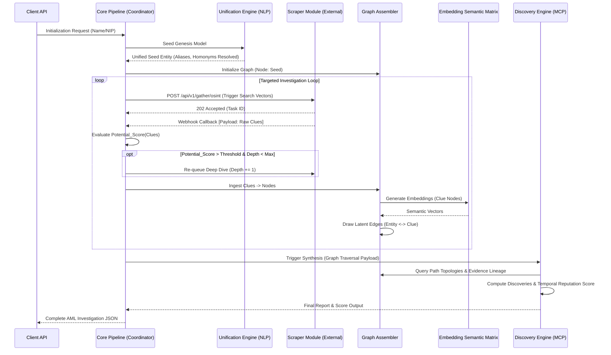

# 1. EXECUTIVE ARCHITECTURE SUMMARY

- **CORE PURPOSE:** Autonomous AML/Due Diligence reputation scoring mapping entity lineage, synthesizing multi-lingual OSINT (Polish/English), identifying anomalous correlations, and algorithmically deriving severity scores.
- **PARADIGM:** Decoupled Intelligence & Acquisition. An isolated, horizontally scalable Scraper Module interacts asynchronously with the core AI Pipeline (Discovery Engine, Graph Assembler).
- **DATA TOPOLOGY:** Directed Property Graph constructing semantic relationships between entities (Seeds), sourced intelligence (Clues), and derived hypotheses (Discoveries). Edge latencies bridged via multi-lingual NLP embeddings.
- **SCORING VECTORS:** Bipartite metric yield: Instantaneous `Severity_Score` $S_t \in [0, 1]$ and Historical Reputation Vector $\mathbf{R} = [R_{t-n}, \dots, R_t]$ derived via temporally-decayed Bayesian evidence aggregation.

# 2. SYSTEM TOPOLOGY & AGENT WORKFLOW



# 3. DATA CONTRACTS & SCHEMAS

## External Scraper HTTP API Specs

```yaml
openapi: 3.1.0
info:
  title: OSINT Acquisition API
  version: 1.0.0
paths:
  /api/v1/gather/osint:
    post:
      summary: Dispatch Async OSINT/Media Crawl
      requestBody:
        required: true
        content:
          application/json:
            schema:
              type: object
              properties:
                entities:
                  type: array
                  items: 
                    type: string
                keywords: 
                  type: array
                  items:
                    type: string
                depth:
                  type: integer
                locale:
                  type: string
                  default: "pl-PL"
      responses:
        '202':
          description: Task Accepted
          content:
            application/json:
              schema:
                properties:
                  taskId: { type: string }

  /api/v1/gather/legal:
    post:
      summary: Dispatch Async Registry/Sanctions Crawl
      requestBody:
        required: true
        content:
          application/json:
            schema:
              properties:
                primary_id: { type: string } # e.g. NIP
                jurisdictions: { type: array, items: { type: string } }
      responses:
        '202': { description: Task Accepted }
```

## Core Database/Graph Schemas

```json
{
  "Definitions": {
    "Node_Seed": {
      "type": "NODE",
      "schema": {
        "id": "UUID",
        "primary_id": "STRING(NIP)",
        "official_name": "STRING",
        "aliases": ["STRING"],
        "board_members": [{"name": "STRING", "role": "STRING"}],
        "ubos": ["STRING"],
        "subsidiaries": ["UUID"],
        "industry_code": "STRING"
      }
    },
    "Node_Clue": {
      "type": "NODE",
      "schema": {
        "id": "UUID",
        "source_url": "URI",
        "timestamp": "ISO8601",
        "raw_extract": "TEXT",
        "source_veracity": "FLOAT",
        "potential_score": "FLOAT",
        "entities_identified": ["STRING"]
      }
    },
    "Node_Discovery": {
      "type": "NODE",
      "schema": {
        "id": "UUID",
        "severity": "FLOAT",
        "category": "ENUM(CORRUPTION, FRAUD, SANCTION, GOVERNANCE)",
        "summary": "TEXT"
      }
    },
    "Edge_Mentions": {
      "type": "EDGE",
      "schema": {
        "source": "UUID(Node_Clue)",
        "target": "UUID(Node_Seed)",
        "context": "STRING",
        "semantic_proximity": "FLOAT"
      }
    },
    "Edge_Derived_From": {
      "type": "EDGE",
      "schema": {
        "source": "UUID(Node_Discovery)",
        "target": "UUID(Node_Clue)",
        "weighting": "FLOAT"
      }
    }
  }
}
```

# 4. PIPELINE CONFIGURATION OBJECTS

```json
{
  "SeedConfig": {
    "fuzzy_match_thresholds": {
      "exact": 1.0,
      "levenshtein_min": 0.85,
      "phonetic_min": 0.80
    },
    "jurisdictional_boundaries": {
      "legal_registries": ["EU", "PL"],
      "media_osint": ["GLOBAL"]
    },
    "alias_resolution_depth": 2
  },

  "InvestigationConfig": {
    "max_search_depth": 3,
    "potential_score_threshold": 0.65,
    "regional_weighting": {
      "PL": 1.0,
      "EU": 0.8,
      "OFFSHORE": 1.5
    },
    "keyword_matrices": {
      "corruption": ["łapówka", "korupcja", "prywata", "nepotyzm"],
      "fraud": ["oszustwo", "wyłudzenie", "przekręt", "defraudacja"],
      "governance": ["zarzuty", "zarząd", "akt oskarżenia"],
      "sanctions": ["sankcje", "pranie pieniędzy", "zamrożenie aktywów"]
    },
    "inflection_handling": {
      "enabled": true,
      "engine": "polish_stemmer_lemmatizer",
      "synonym_expansion": true
    }
  },

  "DiscoveryConfig": {
    "industry_sentiment_modifiers": {
      "FINANCE": { "base_risk": 1.2, "fraud_multiplier": 1.5, "keywords_boost": ["wyłudzenie", "pranie pieniędzy"] },
      "CONSTRUCTION": { "base_risk": 1.1, "corruption_multiplier": 1.4, "keywords_boost": ["łapówka", "korupcja"] },
      "IT": { "base_risk": 0.8, "fraud_multiplier": 1.0, "keywords_boost": ["oszustwo"] }
    },
    "source_veracity_weights": {
      "GOV_REGISTRY": 1.0,
      "COURT_DOCUMENT": 1.0,
      "TIER_1_NEWS": 0.9,
      "TIER_2_NEWS": 0.6,
      "FRINGE_BLOG": 0.2
    },
    "temporal_decay_factors": {
      "half_life_days": 1095,
      "minimum_asymptote": 0.2
    },
    "stock_correlation_flags": {
      "alert_on_drop_pct": 15.0,
      "lookback_window_days": 7
    }
  }
}
```

# 5. HEURISTICS & ALGORITHMIC PROMPTS

### `Potential_Score` Evaluator (Phase 2 Heuristic)
```text
SYSTEM:
Evaluate the input `raw_extract` for investigative potential.
Return ONLY a JSON object: {"potential_score": X.X} where X.X is a float between 0.0 and 1.0.

HEURISTICS:
+0.3 IF exact target entity match exists.
+0.2 IF fuzzy target entity match exists (handle Polish inflection: "Zarządzie", "Zarządowi").
+0.4 IF ANY keywords from `InvestigationConfig.keyword_matrices` are present.
+0.1 IF context implies financial or legal distress.
-0.5 IF text is a generic disclaimer, PR fluff, or unrelated industry.
```

### Mathematical Formulation: Reputation Score & Temporal Decay
The event-specific Severity Score $S_{e,t}$ at time $t$ for a localized event $e$ is calculated as:

```math
S_{e,t} = \left( M_{ind} \times V_{src} \times I_{base} \right) \cdot e^{-\lambda(t - t_0)}
```

Where:
- $M_{ind}$: Industry sentiment multiplier from `DiscoveryConfig`
- $V_{src}$: Source veracity weight $\in (0.2, 1.0]$
- $I_{base}$: Base severity of infraction derived by LLM $\in [0, 1]$
- $\lambda$: Decay constant calculated as $\frac{\ln(2)}{\text{half\_life\_days}}$
- $t - t_0$: Days elapsed since publication.
- Rule: $S_{e,t} = \max(S_{e,t}, \text{minimum\_asymptote})$ if initially verified $> 0.5$.

**Aggregate Current Reputation Score:**
```math
R_{current} = 1.0 - \min\left(1.0, \sum_{e \in E} S_{e,current}\right)
```
*(Score scales downward from 1.0 to 0.0 as severity accumulates)*

**Historical Time-Series Generation:**
Calculate $R_{\tau}$ for $\tau \in \{t_{-365}, t_{-330}, \dots, t_{0}\}$ by applying the decay formula retrospectively across discrete time intervals, yielding a historical array `[1.0, 0.95, 0.60, 0.62...]` for visualization mapping.

### Discovery Engine MCP Architecture & System Prompt

```text
[SYSTEM: DISCOVERY_ENGINE_ORCHESTRATOR]
ACCESS LEVEL: OMNISCIENT
INPUT: Bipartite Graph Data (Seed Nodes, Clue Nodes, Extracted Edges) + DiscoveryConfig.

INSTRUCTION MATRIX:
1. TRUTH IS PARAMOUNT: DO NOT hallucinate. Every `Discovery` MUST map to at least ONE Clue Node via `source_nodes` lineage.
2. LINGUISTIC ALIGNMENT: Unify Polish lemmatization. If Clue uses "wyłudził/wyłudzono" and Keyword is "wyłudzenie", establish semantic equivalency. Account for industry context (e.g. "strata" in IT vs "strata" in logistics).
3. NETWORK RESOLUTION: Identify paths showing hidden lineage. E.g. [Seed: Subsidiary B] -> [Clue: Arrest Record] -> [Keyword: "łapówka"] -> [Seed: Board Member A].
4. SCORING EXECUTION: Apply $I_{base}$ calculation heuristics exactly based off evidence volume. 

OUTPUT SCHEMA (STRICT JSON):
{
  "discoveries": [
    {
      "id": "<uuid>",
      "description": "Evidence of corruption involving Board Member A...",
      "infraction_type": "CORRUPTION",
      "base_severity_assigned": 0.85,
      "source_nodes": ["clue-uuid-1", "clue-uuid-2"]
    }
  ],
  "reputation_metrics": {
    "current_score": 0.62,
    "historical_trend": [1.0, 1.0, 0.60, 0.62],
    "stock_correlation_alert": false
  }
}
```
